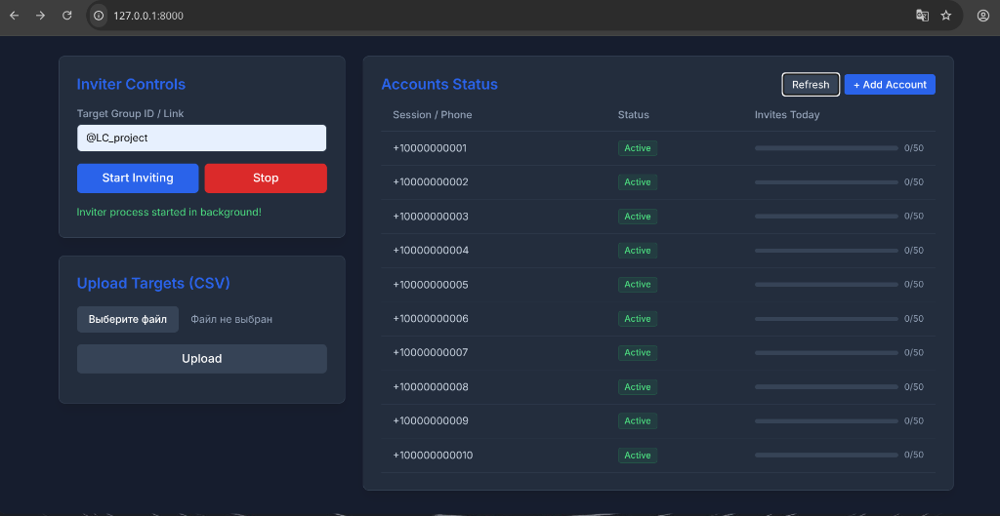
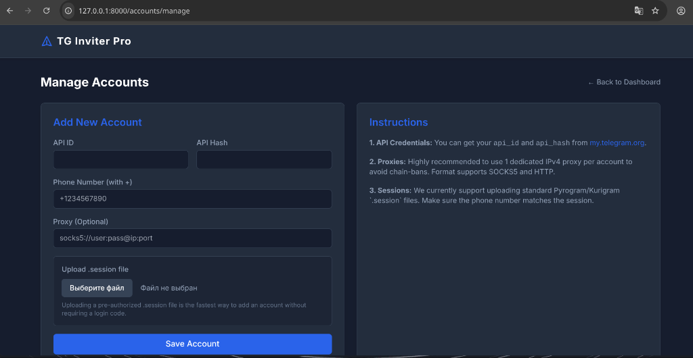
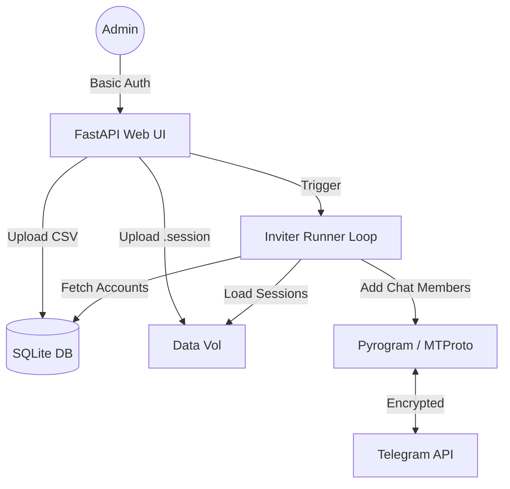

# TG Inviter Pro 🚀

[🇷🇺 Читать на русском языке (Russian)](#ru)

A robust, multi-account Telegram inviting system with a built-in FastAPI web dashboard. Designed to scale, handle Telegram limits gracefully, and operate seamlessly via Docker.

> ⚠️ **DISCLAIMER:** This project is designed strictly for **administrative and organizational purposes**. It is intended to automate adding consenting users to corporate groups, university class groups, and event chats. **This software must NOT be used for spam propagation or any activities that violate Telegram's Terms of Service.** The developers hold no responsibility for accounts banned due to misuse.

## Features ✨
- **Intelligent Multi-Account Rotation**: Automatically distributes invites evenly among active sessions using a true round-robin algorithm.
- **Resilient Engine & Humanized Behavior**: Deep Pyrogram integration handles `FloodWait`, `PeerFlood`, and privacy restrictions without crashing. Simulates human presence and profile views before inviting to reduce bans.
- **FastAPI + HTMX Dashboard**: A lightweight, modern SPA-like dashboard with detailed real-time statistics (Success, Failed, Pending), tightly secured with Basic Auth.
- **Dependency Injection**: Architected with `dishka` & Clean Architecture (DDD) principles.
- **Lightning Fast Deployments**: Uses `uv` package manager, `TgCrypto` for Pyrogram speedups, and optimized multi-stage Docker builds for minimal image size.

### Web Dashboard Preview



---

## Architecture Diagram 🏗


## 🚀 Deployment Guide (Docker)

Docker is the strictly recommended way to run this application, ensuring database integrity and session persistence via volumes.

### 1. Configure Environment Variables
Copy the `.env.example` file to create your own configuration:
```bash
cp .env.example .env
```
Edit the `.env` file. **Crucial variables to set:**
- `ADMIN_USERNAME` & `ADMIN_PASSWORD`: Default is admin/admin. **You MUST change these** to secure the web dashboard.
- `MIN_DELAY_SECONDS` & `MAX_DELAY_SECONDS`: The random delay range between invites (e.g., 300 to 600 seconds) to mimic human behavior.
- `DAILY_INVITE_LIMIT`: Maximum daily invites per single account to prevent `PeerFlood` bans.

### 2. Startup
Run the container in the background:
```bash
docker compose up -d --build
```
Access the dashboard at `http://your-server-ip:8000`.

### Note on CI/CD (GitHub Actions)
This repository does not include pre-configured deployment pipelines (like `.github/workflows/deploy.yml`). If you plan to deploy this via CI/CD, you must create the workflow YAML yourself according to your server infrastructure (e.g. AWS, DigitalOcean, or CapRover).

---

## 💻 Local Development
If you want to contribute or modify the codebase, we use [uv](https://astral.sh) for ultra-fast dependency management:
```bash
# Install dependencies
uv sync

# Run the Uvicorn server locally
uv run uvicorn app.main:app --host 127.0.0.1 --port 8000 --reload
```

<br>
<hr>
<br>

<a id="ru"></a>
# [RU] TG Inviter Pro 🚀

Мощная система для инвайтинга в Telegram с поддержкой множества аккаунтов (Multi-Account) и встроенной веб-панелью управления на базе FastAPI. Спроектировано для стабильной работы, обработки лимитов Telegram и удобного деплоя через Docker.

> ⚠️ **ОТКАЗ ОТ ОТВЕТСТВЕННОСТИ:** Данный проект предназначен ИСКЛЮЧИТЕЛЬНО для **административных и организационных целей**. Он создан для автоматизации добавления знакомых контактов (с их согласия) в корпоративные чаты, учебные группы или чаты мероприятий. **Это программное обеспечение НЕ ДОЛЖНО использоваться для рассылки спама, накрутки ботов или любых действий, нарушающих Правила использования (ToS) Telegram.** Разработчики не несут ответственности за блокировку аккаунтов в результате неправомерного использования.

## Возможности ✨
- **Умная ротация аккаунтов (Round-Robin)**: Равномерно распределяет нагрузку на все живые аккаунты.
- **Отказоустойчивость и имитация человека**: Грамотная обработка `FloodWait`, `PeerFlood` и приватности профилей. Бот имитирует онлайн-присутствие и просмотр профиля человека перед добавлением.
- **FastAPI + HTMX Dashboard**: Легкая и современная панель управления с развернутой статистикой (Успешные, Ошибки, В очереди), закрытая надежной Basic авторизацией.
- **Чистая архитектура**: Использование `dishka` для внедрения зависимостей (DI) и паттернов DDD.
- **Быстрая и легкая сборка**: Пакетный менеджер `uv`, ускорение Pyrogram через `TgCrypto` и многоэтапная (multi-stage) сборка Docker-образа для минимального веса.

## Схема архитектуры 🏗
Архитектуру проекта на английском см. выше в блоке `mermaid`. Проект разделен на веб-слой (Web UI), фоневые задачи (Inviter Runner), персистентное хранилище (SQLite/Volumes) и прямое взаимодействие с MTProto.

## 🚀 Руководство по развертыванию (Docker)

Docker — единственный рекомендуемый способ запуска в Production. Он гарантирует сохранность файлов `.session` и базы `sqlite3` при перезапусках сервера.

### 1. Настройка переменных окружения (Environments)
Скопируйте шаблон конфига:
```bash
cp .env.example .env
```
Откройте созданный файл `.env` и настройте параметры. **Критические переменные:**
- `ADMIN_USERNAME` и `ADMIN_PASSWORD`: Измените дефолтные `admin`/`admin` на надежные данные, иначе любой человек в сети зайдет в вашу панель!
- `MIN_DELAY_SECONDS` и `MAX_DELAY_SECONDS`: Диапазон задержки (в секундах) между приглашениями (рекомендуется 300 - 600 секунд), чтобы Telegram считал действия "человеческими".
- `DAILY_INVITE_LIMIT`: Суточный лимит инвайтов на один аккаунт для защиты от массовых банов.

### 2. Запуск контейнера
Соберите и запустите приложение в фоновом режиме:
```bash
docker compose up -d --build
```
Интерфейс будет доступен по адресу `http://ip-вашего-сервера:8000`.

### Настройка CI/CD (Автоматический деплой)
Проект передается "как есть" (Open Source), поэтому файлы для авто-деплоя (например, `deploy.yml` для GitHub Actions) в репозитории отсутствуют. Если вы планируете настроить CI/CD для развертывания на свой сервер, напишите workflow самостоятельно в зависимости от вашей инфраструктуры.

---

## 💻 Локальная разработка
Мы используем сверхбыстрый менеджер [uv](https://astral.sh).
```bash
# Установка зависимостей
uv sync

# Запуск локального сервера 
uv run uvicorn app.main:app --host 127.0.0.1 --port 8000 --reload
```
